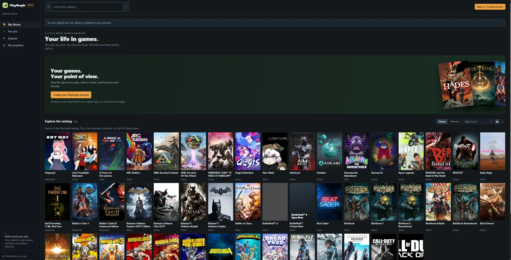
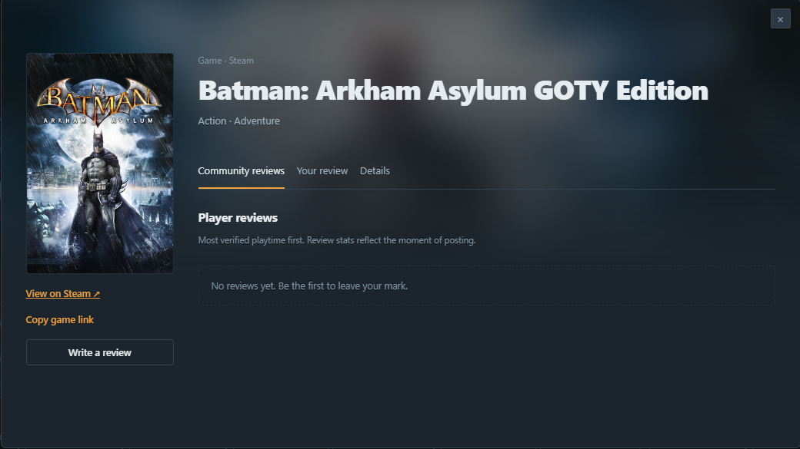
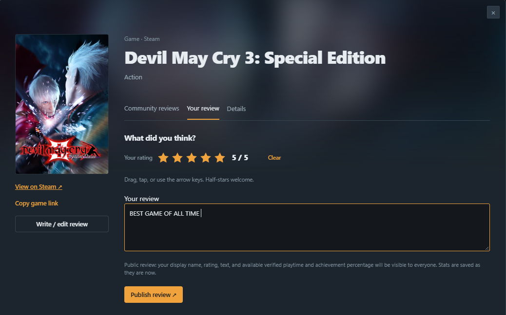
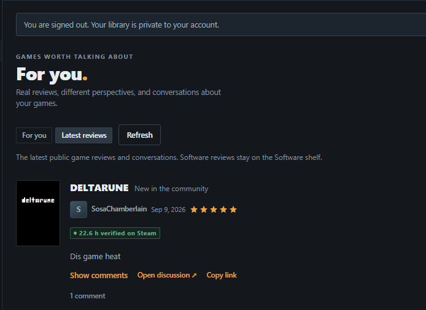
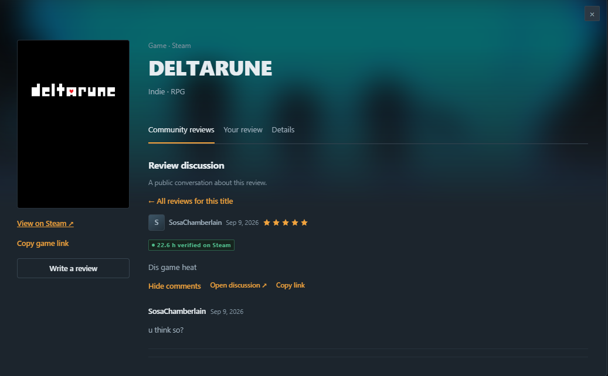
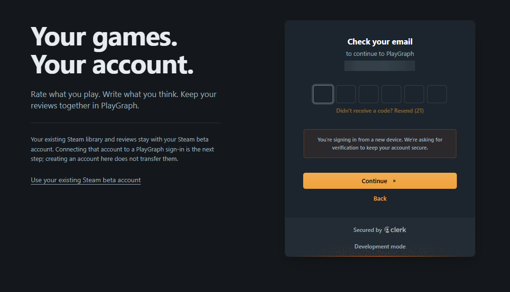

# PlayGraph

[](https://github.com/JakeeUp/playgraph/actions/workflows/security.yml)

Letterboxd for games, with receipts.

Connect Steam and PlayGraph imports your playtime and achievements. When that
data is available, your review keeps a snapshot of it. Two hundred hours or
twenty minutes, there's some context behind the take.

I'm building it around that idea: a place to keep your games and reviews
together, with your play history alongside them.



## What it does

- Steam sign-in, plus PlayGraph accounts through Clerk
- Full library sync in the background, including achievements
- Playtime by genre, with apps like Wallpaper Engine kept out of your game stats
- Drag half-star ratings, plus verified hours and achievements when available
- Comments, a public feed, and a For You feed ranked by your library and genres
- Game pages with community reviews, your review, and shareable links
- Edit or delete your own reviews without changing their original playtime snapshot

| Catalog and feed | Reviews and discussions |
|---|---|
|  |  |
| Game pages pull art from Steam | Drag for half-stars, then publish |
|  |  |
| Verified hours, when available | Each review gets its own thread |

PlayGraph sign-in through Clerk. This is the development build; the email
address is obscured in the screenshot.



Steam beta accounts and PlayGraph accounts are still separate. Creating a new
account doesn't move an existing Steam library or its reviews.

## How it works

- **Verified hours are frozen.** A review saves the latest synced Steam hours
  and achievement progress available when you publish. Those values come from
  append-only snapshots; editing a review doesn't refresh them.
- **Steam login is checked with Steam.** The server verifies OpenID 2.0
  callbacks with Steam before issuing a session.
- **Syncs run as jobs.** Achievements are one API call per game, so a big
  library takes minutes. `POST /me/sync` queues it on arq and the UI polls.
- **Sessions are checked server-side.** Redis holds revocation and rate-limit
  state. Protected requests fail closed if it's unavailable. Browser writes
  also require a session-bound CSRF token and a matching Origin.
- **Rate limits use a sliding window** in a Lua script, so nobody gets a double
  budget at a window edge.
- **Public reads are cached** with generational invalidation, and concurrent
  misses share one query. Writes invalidate the cache; short TTLs limit stale
  reads if invalidation fails. Private library responses aren't cached.

## Measured

Recorded local development runs: SQLite, 3,000 games, 8,000 reviews and 200
simulated visitors browsing public pages. These are successive optimization
runs, not production capacity estimates. p95 is the response time that 95% of
requests finished within.

| Setup | p95 | Throughput |
|---|---|---|
| Cache off, before the query fix | 49 s | 3.9 req/s |
| Cache off, after the query fix | 94 ms | 82 req/s |
| Cache on, with miss coalescing | 41 ms | 84 req/s |

The changes were storing each title's game/software classification in the
database and having concurrent cache misses share a query. The simulated
visitors pause between requests, so these runs don't establish maximum
throughput. Signed-in traffic and hosted performance still need measurement.

## Stack

FastAPI, SQLAlchemy 2, Alembic, and arq on Redis. SQLite locally; Postgres is the
planned deployment database. The frontend is plain ES modules served by FastAPI,
with no build step.

## Run it locally

Use Python 3.14, the version used in development and CI, and a local or hosted
Redis instance. Run these commands from the repository root.

```powershell
python -m venv .venv
.\.venv\Scripts\Activate.ps1
python -m pip install -r requirements.txt
Copy-Item .env.example .env
```

On macOS/Linux, activate with `source .venv/bin/activate` and copy the config
with `cp .env.example .env`. If you already have a `.env`, keep it.

In `.env`, add a [Steam Web API key](https://steamcommunity.com/dev/apikey),
your Redis URL, and a signing secret:

```bash
python -c "import secrets; print(secrets.token_hex(32))"
```

With the API and worker stopped, apply migrations:

```bash
python -m app.migrations upgrade
```

Start the API:

```bash
python -m uvicorn app.main:app
```

In a second terminal, activate the same environment and start the sync worker:

```bash
python -m arq app.worker.WorkerSettings
```

Open [localhost:8000/app](http://localhost:8000/app). On Windows, `dev.bat`
starts both processes. Stop each with Ctrl+C in its terminal before migrating.

PlayGraph accounts are optional. To turn them on, put your Clerk development keys
in `.env.clerk` as `CLERK_PUBLISHABLE_KEY` and `CLERK_SECRET_KEY`, and set
`CLERK_ENABLED=true` in `.env`. Restart the API, then open `/account`.
Keep both environment files out of Git.

## Tests

Node.js is needed for the browser-module checks.

```bash
python -m pytest -q
node --test tests/test_library_ui.mjs
```

CI runs both, plus `pip-audit` and `bandit`, on every push. There's also a
Locust load test in `loadtest/`, and the file explains how to run it.

## Status

Personal project, actively being built, not deployed yet.

Next up is linking Steam to a PlayGraph account, since right now they're
separate. After that: a cross-platform catalog through IGDB, want-to-play and
diary tracking, privacy controls, then public profiles. The full map is in
[PHASES.md](PHASES.md).

More detail: [SECURITY.md](SECURITY.md) for the security review,
[MIGRATIONS.md](MIGRATIONS.md) for upgrades and recovery, and
[PLATFORM_PLAN.md](PLATFORM_PLAN.md) for why Steam comes first.

No license yet, so all rights reserved for now.
